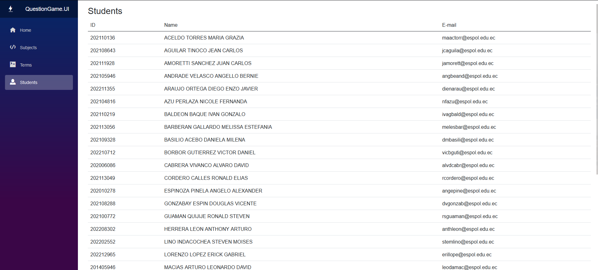
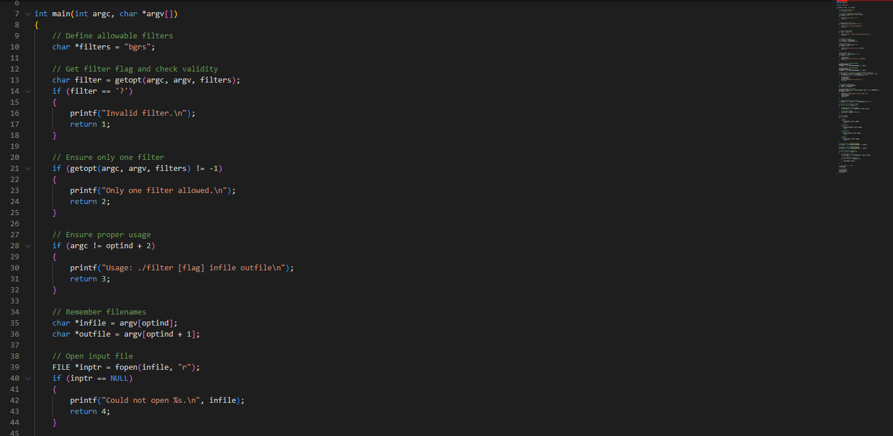

# Mi sitio personal
Este es mi sitio personal. Aquí puedes encontrar información sobre mí, mis proyectos y mis intereses.

## Contenido
* [Información personal](#información-personal)
* [Proyectos](#proyectos)
* [Intereses](#intereses)

## Información personal
* Nombre: Kevin Santiago Mejia Parra
* Ocupación: Desarrollador Backend en .NET
* Lugar de residencia: Guayaquil
* Sitio web: <https://electrokevo.github.io/Electrokevo/>

## Proyectos
* Aplicaciones de escritorio en java con JavaFX y en C#. [repositorio](https://github.com/kesameji/Proyecto)

* Aplicaciones web con ASP.NET Core. [repositorio](https://github.com/Electrokevo/Pubs)

* Aplicaciones de consola con C++ y C. [repositorio](https://github.com/rafariva-classroom/tarea06-alexa-kesameji)

## Conocimientos
* Tecnologias
  * HTML
  * CSS
  * JavaScript
  * TypeScript
* Herramientas
  * FireBase
  * GitHub Pages
* frameworks
  * Angular
* librerias
  * React
  * Boostrap

## Intereses
* Matematica.
* Desarrollo de sistemas.
* Desarrollo de videojuegos.
* Neovim y ArchLinux.
